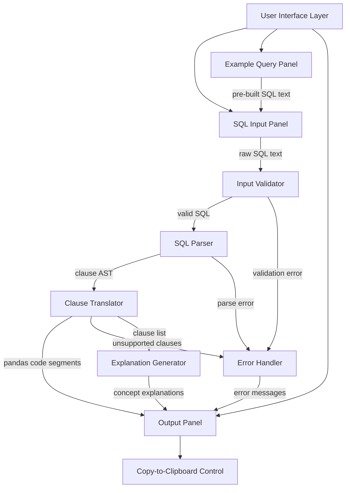
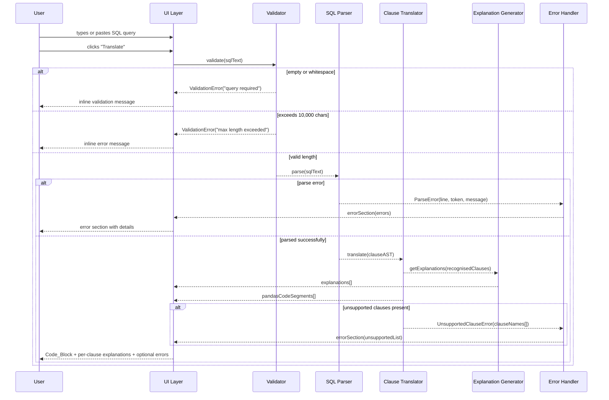
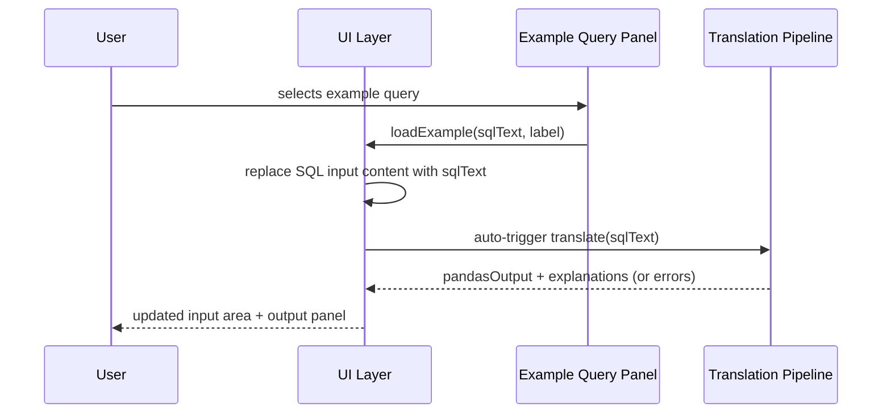
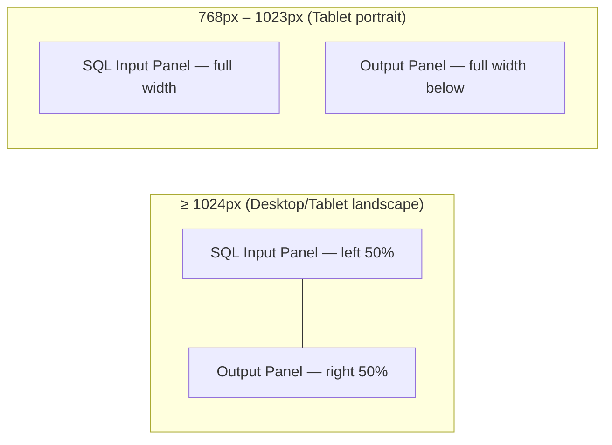

# Design Document: SQL-to-Pandas Translator

## Overview

The SQL-to-Pandas Translator is a single-page web application that helps data analysts learn Python by converting SQL queries they already know into equivalent pandas code, clause by clause. Users paste a SQL query, click "Translate", and immediately see the generated Python code alongside plain-language explanations of how each SQL concept maps to a pandas operation.

The app is designed as a lightweight, front-end-first application. SQL parsing and translation logic runs entirely in the browser (JavaScript/TypeScript), eliminating the need for a backend server and making the app deployable as a static site. Python syntax highlighting is applied client-side using a library such as Prism.js or highlight.js. The architecture prioritises fast feedback, zero latency (no network calls), and progressive disclosure of explanations tied to the clauses present in each query.

## Architecture



### Layer Responsibilities

- **User Interface Layer**: Renders all panels, manages responsive layout, handles keyboard navigation and ARIA attributes.
- **Input Validator**: Checks for empty input, whitespace-only input, and character-length limits before parsing.
- **SQL Parser**: Tokenises and builds a clause-level Abstract Syntax Tree (AST) from the raw SQL text.
- **Clause Translator**: Walks the AST and emits pandas code for each recognised clause.
- **Explanation Generator**: Maps each recognised clause type to a pre-written, human-readable explanation string.
- **Error Handler**: Collects validation errors, parse errors, and unsupported-clause notices into a structured error list for display.

## Sequence Diagrams

### Main Translation Flow



### Example Query Load Flow



## Components and Interfaces

### Component 1: SQL Input Panel

**Purpose**: Accepts raw SQL text from the user and triggers translation.

**Interface**:
```typescript
interface SqlInputPanel {
  value: string                        // current text in the textarea
  onChange(text: string): void         // called on every keystroke
  onSubmit(text: string): void         // called when "Translate" is clicked
  validationMessage: string | null     // inline message below the textarea
  isDisabled: boolean                  // true while a translation is in progress
}
```

**Responsibilities**:
- Render a `<textarea>` with `rows="10"` minimum and `maxlength="10000"`.
- Render a "Translate" `<button>` with an accessible label.
- Show `validationMessage` as an ARIA live-region below the textarea when non-null.
- Pass focus back to the textarea after form submission.

---

### Component 2: Example Query Panel

**Purpose**: Presents labelled pre-built queries the user can load with one click.

**Interface**:
```typescript
interface ExampleQuery {
  id: string           // unique slug, e.g. "basic-select"
  label: string        // max 60 characters, e.g. "Filter rows with WHERE"
  sql: string          // the pre-built SQL text
}

interface ExampleQueryPanel {
  examples: ExampleQuery[]
  onSelect(example: ExampleQuery): void   // replaces SQL input and triggers translation
}
```

**Responsibilities**:
- Render at least five `ExampleQuery` entries as labelled buttons or a list.
- Call `onSelect` when an example is activated (click or keyboard Enter/Space).
- Each button has an accessible name matching `example.label`.

---

### Component 3: Output Panel

**Purpose**: Displays generated pandas code, per-clause explanations, and error messages.

**Interface**:
```typescript
interface ClauseOutput {
  clauseType: ClauseType       // e.g. "SELECT", "WHERE", "GROUP_BY"
  pandasCode: string           // the generated code fragment for this clause
  explanation: string          // human-readable mapping description
}

interface TranslationResult {
  success: boolean
  clauses: ClauseOutput[]           // ordered list of translated clause outputs
  fullPandasCode: string            // complete assembled pandas script
  errors: TranslationError[]        // empty when fully successful
  hasPartialOutput: boolean         // true when some clauses translated, some didn't
}

interface OutputPanel {
  result: TranslationResult | null
}
```

**Responsibilities**:
- Render `fullPandasCode` in a `<code>` block with Python syntax highlighting.
- Render each `ClauseOutput.explanation` adjacent to the code fragment for that clause.
- Render the `CopyButton` component when `fullPandasCode` is non-empty.
- Render the `ErrorSection` component when `errors` is non-empty.

---

### Component 4: Copy Button

**Purpose**: Copies the full pandas output to the system clipboard.

**Interface**:
```typescript
interface CopyButton {
  targetText: string          // the pandas code to copy
  isDisabled: boolean         // true when targetText is empty
  onCopySuccess(): void       // triggers confirmation message
  onCopyFailure(): void       // triggers fallback error message
}
```

**Responsibilities**:
- Use the `navigator.clipboard.writeText()` API.
- Show a "Copied!" confirmation that auto-dismisses after 2–3 seconds.
- On failure, display an inline error and ensure the code block is user-selectable (`user-select: all`).

---

### Component 5: Error Section

**Purpose**: Displays a dedicated, visually separate section for all errors and unsupported-clause notices.

**Interface**:
```typescript
interface TranslationError {
  type: "PARSE_ERROR" | "UNSUPPORTED_CLAUSE" | "VALIDATION_ERROR"
  message: string
  clauseName?: string    // present for UNSUPPORTED_CLAUSE errors
  lineNumber?: number    // present for PARSE_ERROR
  token?: string         // offending token for PARSE_ERROR
}

interface ErrorSection {
  errors: TranslationError[]
}
```

**Responsibilities**:
- Render with a visually distinct container (e.g. amber/red background, warning icon).
- List each error with its type label and message.
- Include `role="alert"` so screen readers announce errors immediately.

## Data Models

### ClauseType Enum

```typescript
type ClauseType =
  | "SELECT"
  | "WHERE"
  | "GROUP_BY"
  | "HAVING"
  | "ORDER_BY"
  | "LIMIT"
  | "JOIN"          // covers INNER, LEFT, RIGHT, FULL OUTER
  | "DISTINCT"
  | "SUBQUERY_FROM"
  | "SUBQUERY_WHERE_HAVING"
```

### ClauseNode (AST)

```typescript
interface ClauseNode {
  type: ClauseType
  rawText: string          // original SQL fragment for this clause
  tokens: string[]         // tokenised clause content
  children?: ClauseNode[]  // for subqueries
}

interface SqlAST {
  raw: string
  clauses: ClauseNode[]
  unsupported: string[]    // clause names not in ClauseType
}
```

**Validation Rules**:
- `raw` must be a non-empty string with at least one non-whitespace character.
- `raw` length must not exceed 10,000 characters.
- `clauses` must contain at least one `ClauseNode` for a successful parse.
- `ClauseNode.rawText` must be a non-empty substring of `SqlAST.raw`.

### TranslationResult

Defined above in Component 3. Additional constraints:
- `fullPandasCode` is the ordered concatenation of all `ClauseOutput.pandasCode` segments, separated by newlines.
- `clauses` are ordered to match the logical pandas execution order: DataFrame assignment → filter → groupby → having → select → sort → head.
- When `hasPartialOutput` is `true`, untranslatable sections are replaced with an inline comment: `# [UNSUPPORTED: <ClauseName>]`.

### ExampleQuery Library

```typescript
const EXAMPLE_QUERIES: ExampleQuery[] = [
  {
    id: "basic-select",
    label: "Select specific columns",
    sql: "SELECT name, age, city FROM employees;"
  },
  {
    id: "where-filter",
    label: "Filter rows with WHERE",
    sql: "SELECT name, salary FROM employees WHERE department = 'Engineering' AND salary > 70000;"
  },
  {
    id: "group-aggregate",
    label: "Group and aggregate with GROUP BY",
    sql: "SELECT department, COUNT(*) AS headcount, AVG(salary) AS avg_salary FROM employees GROUP BY department;"
  },
  {
    id: "inner-join",
    label: "Combine tables with INNER JOIN",
    sql: "SELECT e.name, d.department_name FROM employees e INNER JOIN departments d ON e.department_id = d.id;"
  },
  {
    id: "order-limit",
    label: "Sort and limit results",
    sql: "SELECT name, salary FROM employees ORDER BY salary DESC LIMIT 10;"
  },
  {
    id: "having-filter",
    label: "Filter groups with HAVING",
    sql: "SELECT department, COUNT(*) AS headcount FROM employees GROUP BY department HAVING COUNT(*) > 5;"
  },
  {
    id: "distinct-values",
    label: "Select distinct values",
    sql: "SELECT DISTINCT department FROM employees;"
  }
]
```

## Clause Translation Logic

### SELECT

```
SQL:    SELECT col1, col2 FROM table
Pandas: df[['col1', 'col2']]

SQL:    SELECT * FROM table
Pandas: df  (or df.copy())

SQL:    SELECT COUNT(*) AS total FROM table
Pandas: df['id'].count()   (or len(df) for COUNT(*))
```

Aggregate mapping table:

| SQL Function | Pandas Method    |
|-------------|-----------------|
| COUNT(col)  | `.count()`       |
| COUNT(*)    | `len(df)`        |
| SUM(col)    | `.sum()`         |
| AVG(col)    | `.mean()`        |
| MIN(col)    | `.min()`         |
| MAX(col)    | `.max()`         |

### WHERE

```
SQL:    WHERE col = 'value'
Pandas: df[df['col'] == 'value']

SQL:    WHERE col > 100 AND col2 = 'X'
Pandas: df[(df['col'] > 100) & (df['col2'] == 'X')]

SQL:    WHERE col IS NULL
Pandas: df[df['col'].isna()]
```

Operator mapping:

| SQL Operator | Pandas Equivalent |
|-------------|------------------|
| =           | `==`             |
| <>  / !=    | `!=`             |
| AND         | `&`              |
| OR          | `\|`             |
| NOT         | `~`              |
| IS NULL     | `.isna()`        |
| IS NOT NULL | `.notna()`       |
| IN (...)    | `.isin([...])`   |
| LIKE '%x%'  | `.str.contains('x')` |

### GROUP BY

```
SQL:    GROUP BY dept
Pandas: df.groupby('dept')

SQL:    GROUP BY dept, year
Pandas: df.groupby(['dept', 'year'])
```

When combined with SELECT aggregates, the translator emits:
```python
df.groupby('dept').agg(headcount=('id', 'count'), avg_sal=('salary', 'mean')).reset_index()
```

### JOIN

```
SQL:    INNER JOIN t2 ON t1.id = t2.fk_id
Pandas: pd.merge(t1, t2, left_on='id', right_on='fk_id', how='inner')
```

JOIN type mapping:

| SQL JOIN Type | pandas `how` value |
|--------------|-------------------|
| INNER JOIN   | `'inner'`         |
| LEFT JOIN    | `'left'`          |
| RIGHT JOIN   | `'right'`         |
| FULL OUTER JOIN | `'outer'`      |

### ORDER BY

```
SQL:    ORDER BY salary DESC
Pandas: df.sort_values('salary', ascending=False)

SQL:    ORDER BY dept ASC, salary DESC
Pandas: df.sort_values(['dept','salary'], ascending=[True, False])
```

### LIMIT

```
SQL:    LIMIT 10
Pandas: df.head(10)
```

### HAVING

```
SQL:    HAVING COUNT(*) > 5
Pandas: grouped_df[grouped_df['count'] > 5]
```

Applied as a boolean mask on the result of `groupby().agg()`.

### DISTINCT

```
SQL:    SELECT DISTINCT col
Pandas: df['col'].drop_duplicates()

SQL:    SELECT DISTINCT col1, col2
Pandas: df[['col1','col2']].drop_duplicates()
```

### Subqueries

**FROM subquery:**
```python
# Subquery result assigned to an intermediate DataFrame
subquery_df = df[df['salary'] > 50000][['name', 'department']]
result = subquery_df[['name']]
```

**WHERE/HAVING subquery:**
```python
# Inline nested expression
df[df['dept_id'].isin(dept_df[dept_df['region'] == 'EU']['id'])]
```

## Per-Clause Explanation Templates

```typescript
const EXPLANATIONS: Record<ClauseType, string> = {
  SELECT: "In pandas, column selection uses bracket notation: df[['col1','col2']] for multiple columns, or df['col'] for a single column. df.loc[] can also be used for label-based selection.",
  WHERE: "pandas uses boolean masks for row filtering. Conditions are written as df[df['col'] == value]. Multiple conditions are combined with & (AND) and | (OR), each condition wrapped in parentheses.",
  GROUP_BY: "df.groupby('col') splits the DataFrame into groups. It is almost always followed by an aggregation like .agg(), .sum(), or .count(), and .reset_index() to flatten the result back into a DataFrame.",
  HAVING: "HAVING filters groups after aggregation. In pandas, apply a boolean mask to the grouped result: grouped_df[grouped_df['count'] > 5]. This is equivalent to SQL's HAVING clause.",
  ORDER_BY: "sort_values() sorts a DataFrame. Pass ascending=False for DESC order. For multiple columns, pass lists: df.sort_values(['col1','col2'], ascending=[True, False]).",
  LIMIT: "head(n) returns the first n rows of a DataFrame, equivalent to SQL's LIMIT n.",
  JOIN: "pd.merge() joins DataFrames. The how parameter controls join type: 'inner', 'left', 'right', or 'outer'. left_on and right_on specify the key columns from each DataFrame.",
  DISTINCT: "drop_duplicates() removes duplicate rows. Apply it after column selection to get distinct combinations: df[['col1','col2']].drop_duplicates().",
  SUBQUERY_FROM: "A FROM subquery becomes an intermediate DataFrame in pandas. Assign the inner query result to a variable first, then use that variable in the outer query.",
  SUBQUERY_WHERE_HAVING: "A WHERE subquery is expressed as a nested pandas expression. Use .isin() for IN subqueries, or a direct comparison for scalar subqueries."
}
```

## Error Handling

### Error Scenario 1: Empty or Whitespace Input

**Condition**: User clicks "Translate" with an empty textarea or one containing only spaces/newlines.
**Response**: Inline validation message below the textarea: "Please enter a SQL query before translating."
**Recovery**: Message clears as soon as the user types any non-whitespace character. Translation is not attempted.

---

### Error Scenario 2: Input Exceeds 10,000 Characters

**Condition**: SQL text length exceeds 10,000 characters (checked on submit and on paste).
**Response**: Inline error: "Query exceeds the 10,000 character limit ([actual count] / 10,000 characters)."
**Recovery**: Translation is blocked. User must shorten the query. A character counter below the textarea helps users track length in real time.

---

### Error Scenario 3: SQL Parse Error

**Condition**: SQL Parser cannot tokenise the input as valid SQL.
**Response**: Error section displays: "SQL syntax error on line [N] near '[token]': [description]."
**Recovery**: No pandas output is shown. The SQL input remains editable so the user can correct the syntax.

---

### Error Scenario 4: Unsupported SQL Clause

**Condition**: SQL is valid but contains a construct the Translator does not handle (e.g., window functions, CTEs with `WITH`, `UNION`, stored procedure calls).
**Response**: Error section lists each unsupported clause. If partial translation is possible, the code block shows the partial output with `# [UNSUPPORTED: <ClauseName>]` annotations.
**Recovery**: User can still copy the partial output or simplify the query to remove unsupported clauses.

---

### Error Scenario 5: Clipboard Copy Failure

**Condition**: `navigator.clipboard.writeText()` rejects (browser permission denied or API unavailable).
**Response**: Inline error adjacent to the copy button: "Copy failed. Please select and copy the code manually."
**Recovery**: The code block receives `style="user-select: all"` to make manual selection easy.

## Testing Strategy

### Unit Testing Approach

Test each translator function in isolation using a JavaScript test runner (e.g., Vitest or Jest).

Key unit test groups:
- `InputValidator`: empty string → error, whitespace-only → error, 10,000 chars → valid, 10,001 chars → error.
- `SqlParser`: valid SELECT → correct AST, missing FROM → parse error, nested subquery → child ClauseNode.
- `ClauseTranslator` — one test per clause type:
  - SELECT with aliases, SELECT *, SELECT with aggregates
  - WHERE with AND/OR, IN, IS NULL, LIKE
  - GROUP BY single column, multiple columns
  - JOIN all four types
  - ORDER BY with mixed ASC/DESC
  - LIMIT
  - HAVING
  - DISTINCT
  - Subquery in FROM, subquery in WHERE
- `ExplanationGenerator`: each ClauseType → returns non-empty string referencing the correct pandas construct.
- `ErrorHandler`: parse error → includes line number and token, unsupported clause → lists clause name.

### Property-Based Testing Approach

**Property Test Library**: fast-check (JavaScript)

Key properties to verify:

1. **Round-trip completeness**: For any SQL query composed of supported clauses, the translator always produces non-empty `fullPandasCode`.
2. **Error isolation**: If a query contains any unsupported clause, the result always includes a `TranslationError` of type `UNSUPPORTED_CLAUSE`.
3. **Explanation coverage**: For every `ClauseOutput` in `clauses`, a non-empty explanation string is always present.
4. **Partial output consistency**: When `hasPartialOutput` is `true`, every unsupported clause appears exactly once as a `# [UNSUPPORTED: ...]` comment in `fullPandasCode`.
5. **Character limit**: Input strings longer than 10,000 characters never reach the parser (validator always blocks them first).
6. **Example query validity**: All seven pre-built example queries parse without errors and produce non-empty `fullPandasCode`.

### Integration Testing Approach

End-to-end tests using Playwright or Cypress against the rendered UI:

1. User loads the page → SQL input is empty, output panel is blank, copy button is disabled.
2. User clicks "Translate" with empty input → inline validation message appears, output panel stays blank.
3. User selects "Filter rows with WHERE" example → SQL input is populated, output panel shows pandas code and WHERE explanation.
4. User types a valid GROUP BY query → output shows `groupby()` code and GROUP BY explanation.
5. User clicks copy button → confirmation message appears for 2–3 seconds, then disappears.
6. User types an unsupported clause (e.g., `WITH cte AS (...)`) → error section appears, no crash.
7. Responsive layout check at 768px viewport width → no horizontal scrollbar, all content visible.

## Performance Considerations

- All parsing and translation runs synchronously in the browser. For the expected query sizes (≤ 10,000 characters), translation should complete in under 50 ms on modern hardware, providing an instantaneous feel.
- Syntax highlighting is applied after translation using `requestAnimationFrame` to avoid blocking the UI thread.
- Pre-built example queries are bundled as a static constant — no network fetch required.
- The character counter updates on every `input` event. If performance degrades on very long pastes, debounce the counter update to 100 ms.

## Security Considerations

- The app is entirely client-side. There is no server to protect against SQL injection or code execution — the SQL text is parsed for structure, not executed against any database.
- The generated pandas code is displayed as text inside a `<code>` element and never evaluated with `eval()` or `Function()`.
- Clipboard access uses the modern `navigator.clipboard` API, which requires a secure context (HTTPS) and user gesture — this is the correct, permission-safe approach.
- Content Security Policy headers should be set when deploying: restrict `script-src` to `'self'` and the specific CDN used for syntax highlighting.

## Responsive Layout



- At ≥ 1024 px: two-column layout with both panels visible without vertical scroll.
- At 768 px – 1023 px: single-column stacked layout; output panel scrolls below input panel.
- The Example Query Panel appears above the SQL Input Panel at all viewport widths.
- Font size minimum: 16px for body text, 14px for code blocks (both exceed WCAG contrast requirements at the chosen colour scheme).

## Accessibility

- `<textarea>` has `aria-label="SQL query input"` and `aria-describedby` pointing to the character counter and validation message elements.
- "Translate" button has an explicit `aria-label` and `type="submit"`.
- Copy button has `aria-label="Copy pandas code to clipboard"` and `aria-disabled="true"` when no output is present.
- Error section has `role="alert"` and `aria-live="assertive"` so errors are announced immediately by screen readers.
- Confirmation message ("Copied!") has `aria-live="polite"`.
- All colour choices target a minimum 4.5:1 contrast ratio for normal text and 3:1 for UI component borders.
- Focus order follows the visual reading order: Examples → SQL Input → Translate Button → Copy Button → Output → Error Section.
- Visible focus indicator: 2px solid outline with a minimum 3:1 contrast ratio against the adjacent background.

## Dependencies

| Dependency | Purpose | Suggested Library |
|-----------|---------|------------------|
| SQL Parser | Tokenise and AST-build SQL | `node-sql-parser` (MIT) or `sql.js` |
| Syntax Highlighting | Python code highlighting in the browser | `Prism.js` or `highlight.js` |
| Property-Based Testing | Test generator for correctness properties | `fast-check` |
| Unit Testing | Component and function tests | `Vitest` |
| End-to-End Testing | Full UI integration tests | `Playwright` |
| CSS Framework (optional) | Responsive layout utilities | `Tailwind CSS` or plain CSS Grid/Flexbox |

All dependencies must be pinned to exact versions in `package.json` to ensure reproducible builds.
